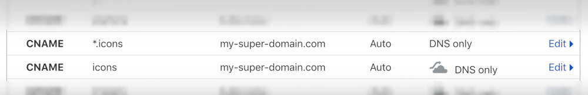
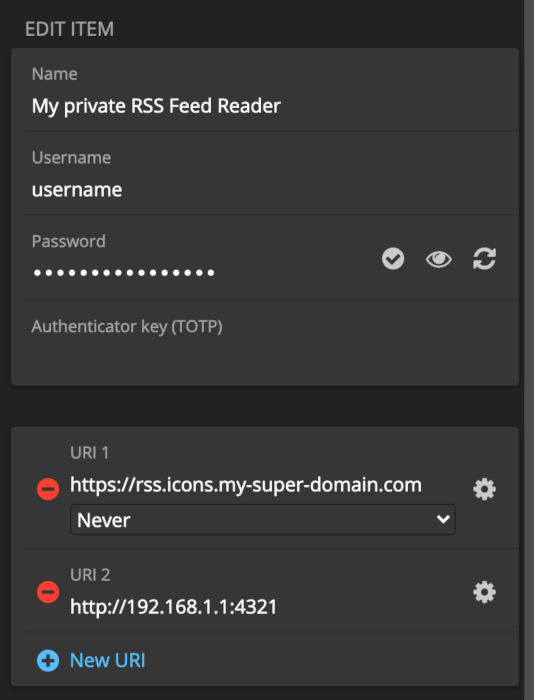
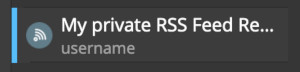

# Serve-Favicons

<div align="center">

Serve **custom and preset Favicons** (website icons) via HTTP(s)
<br><sub>queriable via dynamic URL subdomains and/or HTTP basic auth</sub>

[](https://github.com/Sykkro/serve-favicons/actions?query=workflow%3Abuildx)
[]()
[](https://github.com/Sykkro/serve-favicons/releases)


[](https://hub.docker.com/repository/docker/sykkro/serve-favicons)
[](https://hub.docker.com/repository/docker/sykkro/serve-favicons)
[](https://hub.docker.com/repository/docker/sykkro/serve-favicons)

</div>

### Why?

This project was created with the main purpose of covering some Favicon issues on [Bitwarden](https://github.com/bitwarden)/[bitwarden_rs](https://github.com/dani-garcia/bitwarden_rs):
- Bitwarden incorrectly assumes that domains serve their Favicons on the root-level (i.e. at `http(s)://<domain>/favicon.ico`):
    - This behaviour is discouraged by [W3C's Technical Architecture Group](https://www.w3.org/2001/tag/) (issue: [siteData-36](https://www.w3.org/2001/tag/issues.html?type=1#siteData-36));
    - `<link rel="icon">` elements seem to be ignored, which means that websites that use non-root locations [won't have an icon](https://github.com/bitwarden/browser/issues/675) loaded by Bitwarden (e.g. [Uphold](https://uphold.com/), which hosts its favicon under [/img/favicon.ico](https://uphold.com/img/favicon.ico));
- Having custom icons for either reachable or non-reachable sites is currently not supported;
- There are [privacy concerns](https://bitwarden.com/help/article/website-icons/) regarding website icons:
   - When Bitwarden displays a login item associated with a website, it will issue requests to `icons.bitwarden.net`, leaking information on the websites you access **including private (intranet) hosts**.
  

### How does it work?

Upon load, `serve-favicons` scans the `icons/` folder for directories containing icon (`.ico`) files. These directories will be used internally as _"namespaces"_ and can have arbitrary names as long as they are valid DNS subdomain names, as specified in [RFC1123](https://tools.ietf.org/html/rfc1123) — as a rule of thumb, stick to concise lowercase alphanumeric characters.

Loaded icons will be served by a simple HTTP server on port `8080` by default, which can be retrieved by querying either:
- `http://<icon>.<domain>:<port>`
- `http://<icon>@<host>:<port>` 

Where:
- "`<icon>`" is the resource name, e.g. "`github`" for the GitHub icon;
- "`<domain>`" is a configured URL domain/subdomain when loaded behind a reverse proxy, e.g. "`icons.example.com`" (more on this under the [configurations](#Configurations) section, below);
- "`<host>`" is the server's bound host or IP address, e.g. "`localhost`" or "`127.0.0.1`";
- "`<port>`" is the server's listening port (or an external port, for proxied requests).

Requests to either the root (`/`) or the favicon (`/favicon.ico`) URL path will be answered with a `200` HTTP response with `image/x-icon` content type for matching icons, or a `404` for missing ones.

If desired (e.g. for icons with multiple variants), it is also possible to query for icons under a specific namespace, with either:
- `http://<icon>.<namespace><domain>:<port>`
- `http://<icon>:<namespace>@<host>:<port>` 

### Integrating with Bitwarden

In order to use `serve-favicons` with Bitwarden, you'll need to [run](#Running) the server behind a reverse proxy (ideally with HTTPS) on a publicly accessible domain address. DNS resolution should also be configured so that queries for subdomains resolve to the same host.

Let's assume our domain is `my-super-domain.com` and that we want to use `icons.my-super-domain.com` as a public entrypoint to `serve-favicons`. Example DNS configuration on Cloudflare:



> 💡 To test that our deployment is working, check with:
> ```bash
> $ curl -sLw "%{http_code}\\n" https://rss.icons.my-super-domain.com -o /dev/null
> # should print "200" if OK
> ```

Bitwarden only loads the icon for the first domain, so the _trick_ here is to use our server as **the first URL in the list** and mark it so that it never matches the domain for password detection:



By saving this entry, we can confirm that the icon is loaded from `serve-favicons`:



Now, simply repeat the above step for the remaining entries you wish to tweak, by adding a reference to an existing icon as the first URI and setting match detection to "Never".

---

## Running

### Configurations

On boot, the following default configuration will be used:
```json
{ 
  "domain": "icons.local",
  "port": 8080,
  "icons": {
    "basedir": "icons",
  },
}
```

Field | Description | Default value 
------|-------------|---------------
`domain` | domain to be used to match subdomain-based queries (e.g. "`icons.my-super-domain.com`", from [Integrating with Bitwarden](#Integrating-with-Bitwarden) above) | `icons.local` 
`port` | server listening port | `8080`
`icons.basedir` | location of the root icons directory (will default to the provided icons bundle, next to `server.js`) | `icons`

These defaults can be overridden by an external `config.json` file, whose path can be set via the `ICONS_CONFIG_DIR` environment variable — see [sample/config.json](sample/config.json) for an example of what could be loaded with "`ICONS_CONFIG_DIR=sample`".

By default, `DEBUG` logs will be disabled. If you wish to turn on these logs, set the `ICONS_DEBUG_MODE` environment variable to something truthy (e.g. `"true"`, or `1`).

### Running with NPM

```bash
$ npm start
```

### Running with docker

Alpine-based container image available at [`sykkro/serve-favicons`](https://hub.docker.com/r/sykkro/serve-favicons/).
```bash
$ docker run -p 8080:8080 --rm docker.io/sykkro/serve-favicons:latest
```

#### Available platforms

The architectures supported by this image are:

| OS/Arch | Approx. size |
|---------|--------------|
| linux/amd64  | 28 MB |
| linux/arm64  | 28 MB |
| linux/arm/v7 | 27 MB |


<!-- ### Deploy to kubernetes -->
<!-- TBD -->

## Building

### Install and test with NPM

```bash
$ npm install && npm run lint && npm run test
```

### Docker image
```bash
# multi-platform build with buildx
$ docker buildx build \
--platform=linux/amd64,linux/arm/v7,linux/arm64 \
--output "type=image,push=false" \
-t sykkro/serve-favicons:dev .
```

---

## Credits
### Icons source

Most icons were based on the excellent work from [aegis-icons](https://github.com/aegis-icons/aegis-icons) and converted to `.ico` using [ImageMagick](https://imagemagick.org/index.php)'s `mogrify` command:
```bash
mogrify -quiet -format ico -density 256x256 -background none -define icon:auto-resize=256 -path output icons/*.png
```

---

## Disclaimer

As with the [aegis-icons project](https://github.com/aegis-icons/aegis-icons), this project includes material that may be protected as a trademark in some jurisdictions. Trademarks seen here in "serve-favicons" project does not indicate endorsement to the brands. If you want to use this project and choose to expose icons publicly, you have to ensure that you have the legal right to do so and that you do not infringe any trademark rights. Please do not use brand based icons for any purpose except to represent the company, product, or service to which they refer. The CC0 license applies only to templates, texts, codes and some of the icons. Everything else is either licensed (see the credits) or property of trademark owners. If you're owner of certain trademark(s) and want icon taken down for whatever reason, please [make a new issue](/issues/new).

---